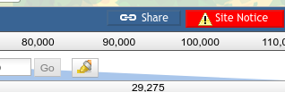
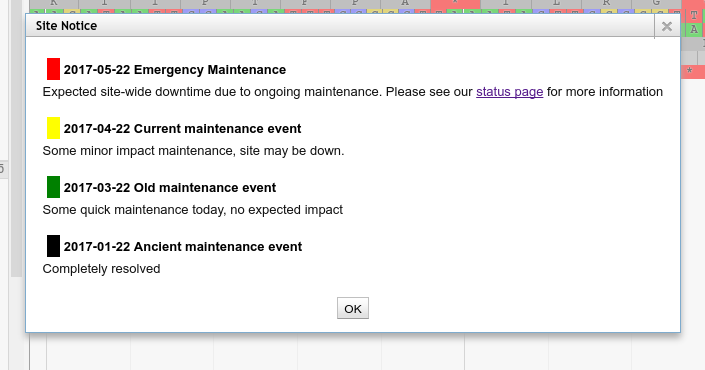

# JBrowse Site-wide Notice Plugin

A JBrowse plugin for showing a button and associated popup if there are
site-wide notices that JBrowse users should be aware of. E.g.
maintenance events that will impact JBrowse or Apollo users.

It renders itself as a small, brightly coloured popup button (some
styling options are exposed in the plugin's configuration):



And when clicked will display a small popup dialog informing users about
ongoing or previous maintenance events:



If a user has seen all of the notices before (based on a cookie) the button
will be a more normal colour so as to not be an annoyance. This allows the
administrator to ensure that people are not forced to see the same notices over
and over again.


## Example configuration

```json
[plugins.SitewideNotice]
#location = plugins/SitewideNotice
location = https://cdn.rawgit.com/TAMU-CPT/SitewideNotices/66210a07971e9c9bb1e3f87e1e4d36aa604ff0cb/
notice_url = https://fqdn.edu/notices.json
label = Site Notice
background_color = red
popup_title = Site Notice
```

Then on your server side, you simply write a small JSON file containing
an array of notices to display to your users. We've included some default CSS
classes to style the popup, but these can be overridden locally.

## Notices JSON File

```json
[
    {
        "id": "6331f144-1ed3-4a83-b518-6b103ea4ff90",
        "title": "2017-05-22 Emergency Maintenance",
        "message": "Expected site-wide downtime due to ongoing maintenance. Please see our <a href='https://example.com/'>status page</a> for more information",
        "class": "severity_2 ongoing"
    },
    {
        "id": "8a6c91ff-c4f9-4a9e-8faa-7b4b5685d195",
        "title": "2017-04-22 Current maintenance event",
        "message": "Some minor impact maintenance, site may be down.",
        "class": "severity_1 ongoing"
    },
    {
        "id": "1f0f1a94-dd68-4bec-b72e-37f9c6555fe1",
        "title": "2017-03-22 Old maintenance event",
        "message": "Some quick maintenance today, no expected impact",
        "class": "severity_0"
    },
    {
        "id": "40851263-894f-4a62-8869-f90d80dc815b",
        "title": "2017-01-22 Ancient maintenance event",
        "message": "Completely resolved",
        "class": "severity_0 resolved"
    }
]
```

CSS Class Name | Meaning                   | Visual Style
-------------- | ---------------           | -----------
`severity_0`   | Low Impact                | Green bar to left
`severity_1`   | Medium Impact             | Yellow bar
`severity_2`   | High Impact               | Red bar
`ongoing`      | An ongoing issue          | (no style)
`resolved`     | Completely resolved issue | Black bar


## License

AGPL-3.0

## Support

This material is based upon work supported by the National Science Foundation under Grant Number (Award 1565146)
